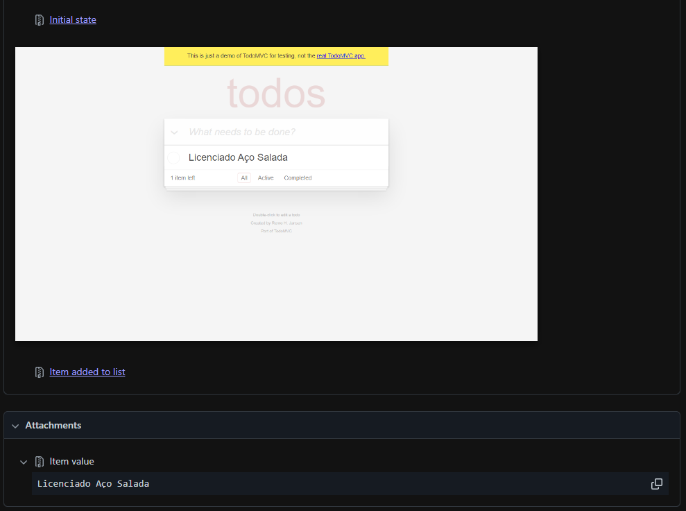
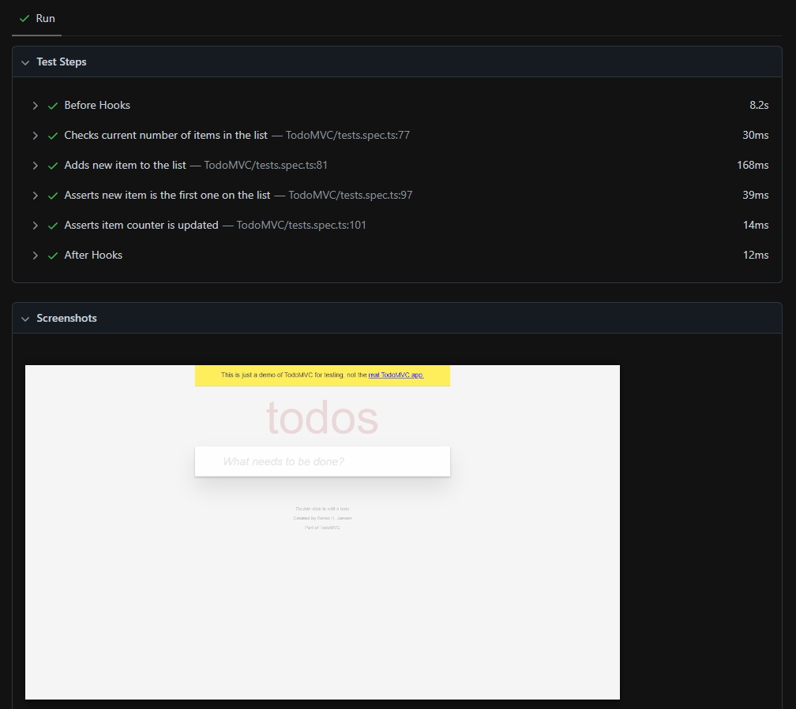

# `playwright-typescript-mvp`

This repository contains a "To Do List" web application automated test suite written in TypeScript. This suite uses both Playwright's native test runner and webdriver. It's objective is to show some good practices acquired through experience and present a starting point for QA Engineers projects and Playwright's newcomers :)

## Features

- Modularized architecture which can be replicated to other pages and web applications tests
- Test steps written in Behavior Driven Development (BDD)
- Reports including screenshots and applied input data

## Structure

```
reports/
tests/
  |-  [module]/
  |     |- assertions.ts
  |     |- locators.ts
  |     |- navigations.ts
  |     |- tests.spec.ts
  |     |- utils.ts
package.json
playwright.config.ts
```
### `tests`

Contains the test cases and their auxiliary scripts to get components on screen, interact with them and then validate the expected results. 

#### `[module]`

The tests cases are separated by `[module]` folders, which represents isolated pages. Alternatively, they can be separated by isolated features, since multiple features may share the same page.

Each `[module]` contains specific methods divided in submodules - assertions, locators, navigations and utils - plus the actual test cases scripts.

```
Login/
  |- assertions.ts
  |- locators.ts
  |- navigations.ts
  |- tests.spec.ts
  |- utils.ts
AddUser/
  |- ...
```

##### `locators.ts`

Methods which return a component - or a set of components - from the page.

```ts
import { Locator, Page } from "@playwright/test";

export default {

  getNewTodoTextBox: (page: Page): Locator => {
    return page.locator("input[class='new-todo']");
  },

  getTodoItems: (page: Page): Locator => {
    return page.getByTestId("todo-item");
  },

}
```

On test environments, it's highly recommended to place a `data-testid` attribute on components used and viewed frequently, such as textboxes, selectors, checkboxes, tables, etc. This way, they can be reached easily by the `getByTestId` method.

##### `navigations.ts`

Methods which interact with the components previously mapped for automated browsing.

```ts
import { Page } from "@playwright/test";
import locators from "./locators";

export default {
  
  addItemToList: async (page: Page, item: string) => {
    await locators.getNewTodoTextBox(page).fill(item);
    await locators.getNewTodoTextBox(page).press("Enter");
  },

  removeItemFromListByIndex: async (page: Page, index: number) => {
    // This button component changes when hovered. So, the item must be hovered first
    await locators.getTodoItems(page).nth(index).hover();
    await locators.getRemoveItemButtons(page).nth(index).click();
  },

}
```

##### `utils.ts`

Methods which are frequently used during testing, such as populating lists within random items.

```ts
import { Page } from "@playwright/test";
import { fakerPT_BR as faker } from "@faker-js/faker";
import navigations from "./navigations";

export default {

  populateListWithRandomItems: async (page: Page, numItems: number) => {
    for ( let i=0; i<numItems; i++ ) {
      const newItem = faker.commerce.productName();
      await navigations.addItemToList(page, newItem);
    }
  },

  markRandomItemsAsCompleted: async (page: Page, totalItems: number): Promise<number> => {
    var numItemsCompleted = 0;
    for ( let i=0; i<totalItems; i++ ) {
      let randInt = faker.number.int({ min: 0, max: 1});
      // Marks if randInt is odd
      if ( randInt & 0x01 ) {
        numItemsCompleted++;
        await navigations.markItemAsCompleted(page, i);
      }
    }
    return numItemsCompleted;
  },

}
```

**Why are these methods not on `navigations.ts`?**

Because I wanted `navigations.ts` to be as close as possible from application's core usabilites. Any other auxiliary navigation methods should be on `utils.ts`.

##### `assertions.ts`

Methods which validate expected results from user's navigations.

```ts
import { expect, Page } from "@playwright/test";

import locators from "./locators";

export default {

  newItemIsCreated: async (page: Page, item: string) => {
    const newItem = locators.getTodoItems(page).nth(0);
    await expect.soft(newItem).toBeVisible();
    await expect.soft(newItem).toHaveText(item);
  },

  itemIsStillListed: async (page: Page, item: string) => {
    const listedItem = locators.getTodoItems(page).getByText(item);
    await expect.soft(listedItem).toBeVisible();
  },

}
```

**Why `expect.soft`?**

Personally, my favorite Playwright's feature. It allows me to mark tests as failed, but still being able to check other validations. So, instead of finding one error, fix it and then finding another two afterwards, I can find and correct them all at once.

##### `tests.spec.ts`

The protagonist. Working together with the feature's submodules, it contains the test cases to be executed.

```ts
import test from "@playwright/test";
import { fakerPT_BR as faker } from "@faker-js/faker";

import utils from "./utils";
import navigations from "./navigations";
import assertions from "./assertions";
import locators from "./locators";

test("Adds new item to the list", async ({ page }, testInfo) => {

  var numItemsList: number;
  var newItem: string;

  await test.step("Checks current number of items in the list", async () => {
    numItemsList = await locators.getTodoItems(page).count();
  });

  await test.step("Adds new item to the list", async () => {
    newItem = faker.commerce.productName();

    await testInfo.attach("Item value", {
      body: newItem,
      contentType: "text/plain"
    });

    await navigations.addItemToList(page, newItem);

    await testInfo.attach("Item added to list", {
      body: await page.screenshot(),
      contentType: "image/png",
    });
  });

  await test.step("Asserts new item is the first one on the list", async () => {
    await assertions.newItemIsCreated(page, newItem);
  });

  await test.step("Asserts item counter is updated", async () => {
    await assertions.itemCountIsCorrect(page, numItemsList+1);
  });

});

```

Although these tests do not implement Cucumber nor use Gherkin syntax, they are divided into `test.step` blocks, 
highlighting, initial states (`Given`), user actions (`When`), expected outcomes (`Then`). Playwright also supports hooks for setup and teardown steps, such as `beforeAll`, `beforeEach`, `afterEach` and `afterAll`.

In addition, each user action also includes a screenshot and/or a text data to be attached to the report for detailed analysis of test failures or feature working properly.

### `reports`

Contains the tests' report on HTML format. It includes each test's step result, screenshots and user input history.





### `playwright.config.ts`

Playwright's configuration file, where you can set up:

- Tests directory
- Reports format and their output folder
- Base url for `goto` navigation
- Browsers where tests will be executed
- Headless mode
- Parallel mode
- Etc.

## How to Test

Just run `npx playwright test`. Tests will be executed as set up on `playwright.config.ts`.

Enjoy! :)
